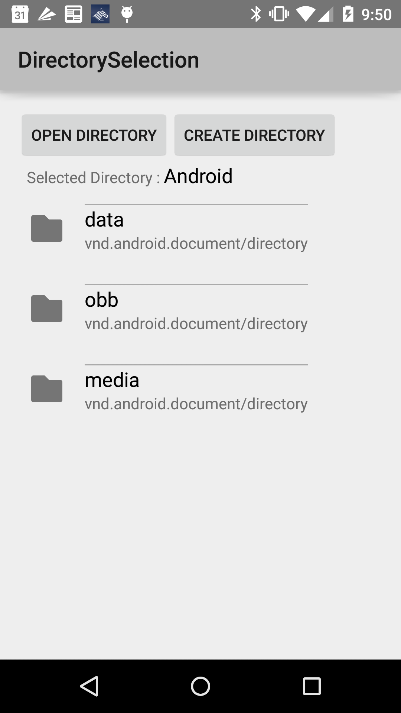
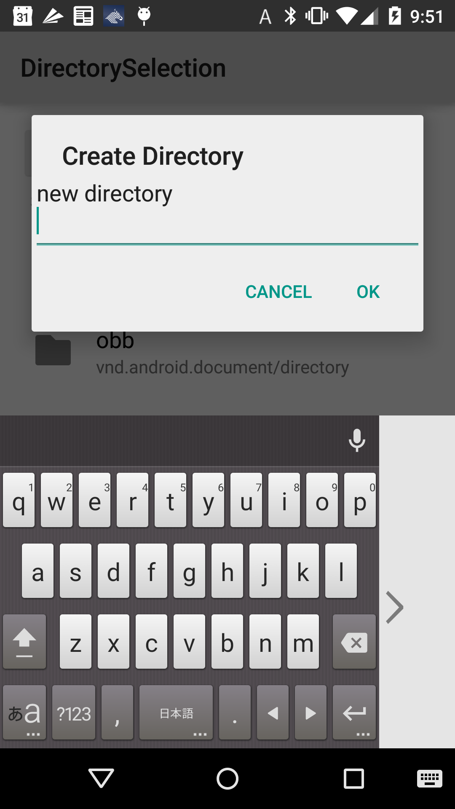
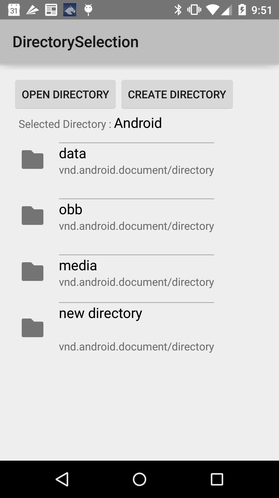

Android DirectorySelection Sample
===================================

A basic app showing how to use Directory Selection API to let users
select an entire directory subtree, which extends the Storage Access Framework
introduced in Android 4.4 (API level 19).

Introduction
------------

The [Directory Selection][1] API, which was introduced in Android 5.0 (API level 21)
extends the [Storage Access Framework][2] to let users select an entire directory subtree,
giving apps read/write access to all contained documents without requiring user
confirmation for each item.

To select a directory subtree, build and send an [OPEN_DOCUMENT_TREE intent][3] like in the
following code:

```java
Intent intent = new Intent(Intent.ACTION_OPEN_DOCUMENT_TREE);
startActivityForResult(intent, REQUEST_CODE_OPEN_DIRECTORY);
```

The system displays all [DocumentsProvider][4] instances that support subtree selection,
 letting the user browse and select a directory.

The returned URI represents access to the selected subtree. You can then use
[buildChildDocumentsUriUsingTree()][5] to access to the child documents and
[buildDocumentUriUsingTree()][6] to access to the selected directory itself along with [query()][7]
to explore the subtree.

This example explores the child documents and the selected document by following code:

```java
@Override
public void onActivityResult(int requestCode, int resultCode, Intent data) {
    super.onActivityResult(requestCode, resultCode, data);
    if (requestCode == REQUEST_CODE_OPEN_DIRECTORY && resultCode == Activity.RESULT_OK) {
        updateDirectoryEntries(data.getData());
    }
}

void updateDirectoryEntries(Uri uri) {
    ContentResolver contentResolver = getActivity().getContentResolver();
    Uri docUri = DocumentsContract.buildDocumentUriUsingTree(uri,
            DocumentsContract.getTreeDocumentId(uri));
    Uri childrenUri = DocumentsContract.buildChildDocumentsUriUsingTree(uri,
            DocumentsContract.getTreeDocumentId(uri));

    Cursor docCursor = contentResolver.query(docUri, new String[]{
            Document.COLUMN_DISPLAY_NAME, Document.COLUMN_MIME_TYPE}, null, null, null);
    try {
        while (docCursor.moveToNext()) {
            Log.d(TAG, "found doc =" + docCursor.getString(0) + ", mime=" + docCursor
                    .getString(1));
            mCurrentDirectoryUri = uri;
            mCurrentDirectoryTextView.setText(docCursor.getString(0));
            mCreateDirectoryButton.setEnabled(true);
        }
    } finally {
        closeQuietly(docCursor);
    }

    Cursor childCursor = contentResolver.query(childrenUri, new String[]{
            Document.COLUMN_DISPLAY_NAME, Document.COLUMN_MIME_TYPE}, null, null, null);
    try {
        List<DirectoryEntry> directoryEntries = new ArrayList<>();
        while (childCursor.moveToNext()) {
            Log.d(TAG, "found child=" + childCursor.getString(0) + ", mime=" + childCursor
                    .getString(1));
            DirectoryEntry entry = new DirectoryEntry();
            entry.fileName = childCursor.getString(0);
            entry.mimeType = childCursor.getString(1);
            directoryEntries.add(entry);
        }
        mAdapter.setDirectoryEntries(directoryEntries);
        mAdapter.notifyDataSetChanged();
    } finally {
        closeQuietly(childCursor);
    }
}
```

Also, the new [createDocument()][8] method lets you create new documents or directories
anywhere under the subtree.

This example creates a new directory by following code:

```java
ContentResolver contentResolver = getActivity().getContentResolver();
Uri docUri = DocumentsContract.buildDocumentUriUsingTree(uri,
        DocumentsContract.getTreeDocumentId(uri));
Uri directoryUri = DocumentsContract
        .createDocument(contentResolver, docUri, Document.MIME_TYPE_DIR, directoryName);
```

[1]: https://developer.android.com/about/versions/android-5.0.html#Storage
[2]: https://developer.android.com/guide/topics/providers/document-provider.html
[3]: https://developer.android.com/reference/android/content/Intent.html#ACTION_OPEN_DOCUMENT_TREE
[4]: https://developer.android.com/reference/android/provider/DocumentsProvider.html
[5]: https://developer.android.com/reference/android/provider/DocumentsContract.html#buildChildDocumentsUriUsingTree(android.net.Uri%2C%20java.lang.String)
[6]: https://developer.android.com/reference/android/provider/DocumentsContract.html#buildDocumentUriUsingTree(android.net.Uri%2C%20java.lang.String)
[7]: https://developer.android.com/reference/android/content/ContentResolver.html#query(android.net.Uri%2C%20java.lang.String%5B%5D%2C%20java.lang.String%2C%20java.lang.String%5B%5D%2C%20java.lang.String)
[8]: https://developer.android.com/reference/android/provider/DocumentsContract.html#createDocument(android.content.ContentResolver%2C%20android.net.Uri%2C%20java.lang.String%2C%20java.lang.String)

Pre-requisites
--------------

- Android SDK 27
- Android Build Tools v27.0.2
- Android Support Repository

Screenshots
-------------

   

Getting Started
---------------

This sample uses the Gradle build system. To build this project, use the
"gradlew build" command or use "Import Project" in Android Studio.

Support
-------

- Google+ Community: https://plus.google.com/communities/105153134372062985968
- Stack Overflow: http://stackoverflow.com/questions/tagged/android

If you've found an error in this sample, please file an issue:
https://github.com/googlesamples/android-DirectorySelection

Patches are encouraged, and may be submitted by forking this project and
submitting a pull request through GitHub. Please see CONTRIBUTING.md for more details.

License
-------

Copyright 2017 The Android Open Source Project, Inc.

Licensed to the Apache Software Foundation (ASF) under one or more contributor
license agreements.  See the NOTICE file distributed with this work for
additional information regarding copyright ownership.  The ASF licenses this
file to you under the Apache License, Version 2.0 (the "License"); you may not
use this file except in compliance with the License.  You may obtain a copy of
the License at

http://www.apache.org/licenses/LICENSE-2.0

Unless required by applicable law or agreed to in writing, software
distributed under the License is distributed on an "AS IS" BASIS, WITHOUT
WARRANTIES OR CONDITIONS OF ANY KIND, either express or implied.  See the
License for the specific language governing permissions and limitations under
the License.
